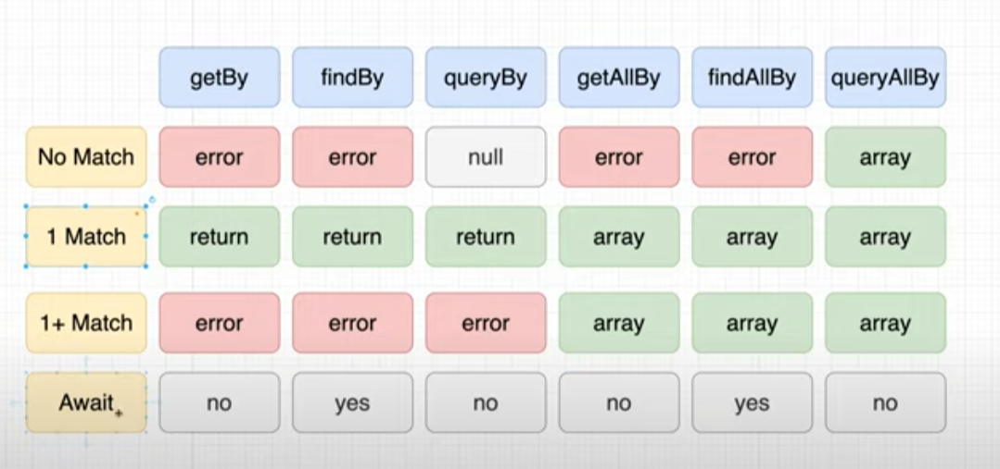

what define a test block:\
-render a componentt we want to test => 1\
-find elements we want to interact with => 2\
-interact with those elements => 3\
-assert that the results are as expected => 4

    it('should fetch and render input element', async () => {
        //1
            render(
                <MockFollowersList />
            );
        //2
            const followerDivElement = await screen.findByTestId(`follower-item-0`)
        //3 + 4
            expect(followerDivElement).toBeInTheDocument();
        });

screen is the way to interact with the component that we called (render)

     const followerDivElement = await screen.findByTestId(`follower-item-0`)

differents way to interact with screen. =>

  <kbd>
    </img>
  </kbd>

remember for async => findBy or findAllBy

integration test:

-possibility to use some loops (JS code)

    const addTask = (tasks) => {
        const inputElement = screen.getByPlaceholderText(/Add a new task here.../i);
        const buttonElement = screen.getByRole("button", { name: /Add/i} );
        tasks.forEach((task) => {
            fireEvent.change(inputElement, { target: { value: task } });
            fireEvent.click(buttonElement);
        })
    }

    it('should be able to type into input', () => {
    render(
        <MockTodo />
    );
    addTask(["Go Grocery Shopping"])
    const divElement = screen.getByText(/Go Grocery Shopping/i);
    expect(divElement).toBeInTheDocument()
    });

-use the getElementId for testing is :

    

    it('should fetch and render input element', async () => {
        render(
            <MockFollowersList />
        );
        const followerDivElement = await screen.findByTestId(`follower-item-0`)
        expect(followerDivElement).toBeInTheDocument();
    });

it would be screengetByTestId("follower-item-0") if not async

-why we use mocks to simulate API, requests cost money, requests are slow,
our tests dependent on something external
-to do that, create a __mocks__ folder\
-inside the axios.js file:\

i create the object (in relation with what is expected in the request ):

    const mockResponse = {
        data: {
            results: [
                {
                    name: {
                        first: "Laith",
                        last: "Harb"
                    },
                    picture: {
                        large: "https://randomuser.me/api/portraits/men/59.jpg"
                    },
                    login: {
                        username: "ThePhonyGOAT"
                    }
                }
            ]
        }
    }

and export it with jest method:

    export default {
        get: jest.fn().mockResolvedValue(mockResponse)
    }

if need it, set-up createJestConfig.js file in react scripts

    resetMocks: false